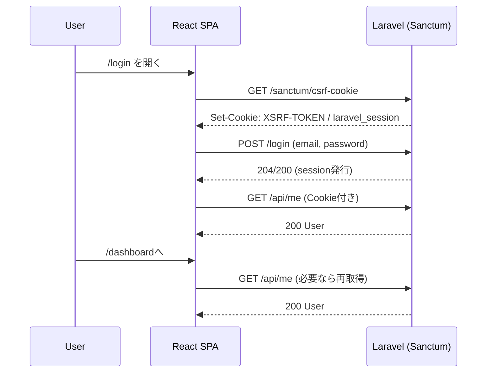

```mermaid
sequenceDiagram
  participant U as User
  participant FE as React SPA
  participant BE as Laravel (Sanctum)

  U->>FE: /login を開く
  FE->>BE: GET /sanctum/csrf-cookie
  BE-->>FE: Set-Cookie: XSRF-TOKEN / laravel_session

  FE->>BE: POST /login (email, password)
  BE-->>FE: 204/200 (session発行)

  FE->>BE: GET /api/me (Cookie付き)
  BE-->>FE: 200 User

  U->>FE: /dashboardへ
  FE->>BE: GET /api/me (必要なら再取得)
  BE-->>FE: 200 User

```
